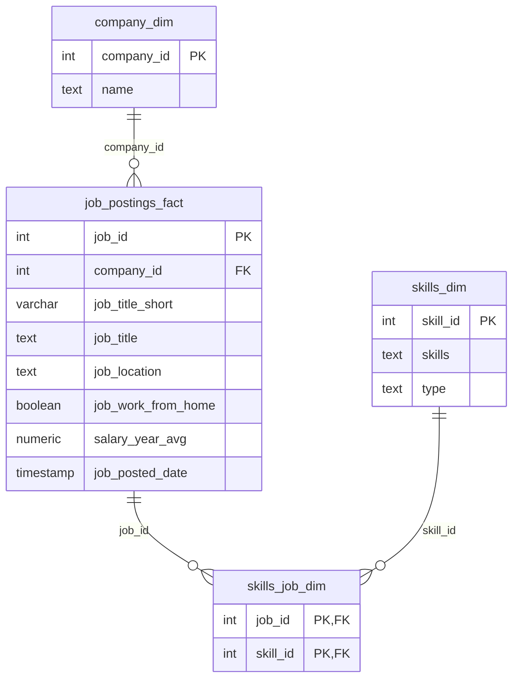

# SQL Job Market Analysis

### Анализ вакансий Data Analyst: зарплаты, востребованные навыки и удалённая работа

**PostgreSQL · SQL · CTE · JOIN · Aggregations · Data Analysis**

Какие вакансии аналитика данных предлагают самую высокую оплату? Какие навыки чаще всего требуются для удалённой работы? И как меняется картина, если учитывать одновременно зарплату и спрос?

Этот проект исследует рынок вакансий Data Analyst на историческом наборе данных, преимущественно за 2023 год. Пять SQL-запросов последовательно раскрывают зарплатные лидеры, требования работодателей и сочетание востребованности навыков с уровнем оплаты.

> **Ключевой результат:** SQL лидирует по числу упоминаний в удалённых вакансиях — **7 291**. Python и Tableau сочетают заметный спрос с высокой средней зарплатой в выборке вакансий с указанной оплатой. Максимальные зарплатные показатели отдельных технологий требуют осторожной интерпретации: иногда за ними стоят всего одна или две вакансии.

---

## Содержание

- [Введение](#introduction)
- [Контекст и вопросы исследования](#background)
- [Инструменты](#tools)
- [Данные и методология](#data)
- [Анализ](#analysis)
- [Что я изучил](#learning)
- [Выводы](#conclusions)
- [Структура проекта](#structure)
- [Как запустить проект](#setup)
- [Ограничения и дальнейшее развитие](#limitations)

<a id="introduction"></a>
## Введение

Цель проекта — с помощью SQL исследовать требования к аналитикам данных и понять, как востребованность навыков соотносится с зарплатами в объявлениях о работе.

Основное внимание уделено удалённым вакансиям категории `Data Analyst`. Анализ включает как конкретные предложения работодателей, так и агрегированные показатели по навыкам. Это позволяет рассмотреть рынок с двух сторон: какие роли находятся в верхней части зарплатного рейтинга и какие инструменты встречаются в большем числе вакансий.

Проект демонстрирует работу с реляционной моделью данных, соединение таблиц, построение CTE, фильтрацию выборок и интерпретацию агрегатов. Все основные запросы находятся в [project_sql](project_sql/).

<a id="background"></a>
## Контекст и вопросы исследования

Высокая средняя зарплата навыка и его популярность — разные характеристики. Редкая технология может возглавлять зарплатный рейтинг, но встречаться в небольшом числе объявлений. Массовый инструмент может предлагать более широкий выбор вакансий при менее высокой средней оплате.

Исследование построено вокруг пяти вопросов:

| № | Вопрос | SQL-запрос |
|:--:|---|---|
| 1 | Какие удалённые вакансии Data Analyst предлагают самые высокие годовые зарплаты? | [1_top_paying_jobs.sql](project_sql/1_top_paying_jobs.sql) |
| 2 | Какие навыки указаны в этих высокооплачиваемых вакансиях? | [2_top_paying_jobs_skills.sql](project_sql/2_top_paying_jobs_skills.sql) |
| 3 | Какие навыки чаще всего встречаются в удалённых вакансиях Data Analyst? | [3_top_remote_jobs_skills.sql](project_sql/3_top_remote_jobs_skills.sql) |
| 4 | Какие навыки связаны с самой высокой средней годовой зарплатой? | [4_top_paying_skills.sql](project_sql/4_top_paying_skills.sql) |
| 5 | Как выглядит зарплатный рейтинг, если оставить навыки со спросом более 10 вакансий? | [5_optimal_skills.sql](project_sql/5_optimal_skills.sql) |

<a id="tools"></a>
## Инструменты

| Инструмент | Роль в проекте |
|---|---|
| **SQL** | Извлечение данных, фильтрация, соединение таблиц и расчёт показателей |
| **PostgreSQL** | Хранение данных, первичные и внешние ключи, выполнение запросов |
| **Visual Studio Code** | Работа с SQL-файлами и документацией |
| **Git / GitHub** | Контроль версий и публикация исходного кода |
| **CSV / psql** | Загрузка исходных таблиц с помощью `\copy` |

Основные SQL-приёмы: `INNER JOIN`, `LEFT JOIN`, `WITH`, `GROUP BY`, `COUNT`, `AVG`, `ROUND`, `ORDER BY`, `LIMIT` и проверка `IS NOT NULL`.

<a id="data"></a>
## Данные и методология

### Масштаб набора данных

Показатели ниже рассчитаны по локальным CSV проекта:

| Показатель | Значение |
|---|---:|
| Все вакансии | 787 686 |
| Компании | 140 033 |
| Записи в справочнике навыков | 259 |
| Связи «вакансия — навык» | 3 669 604 |
| Вакансии категории Data Analyst | 196 593 |
| Data Analyst с `job_work_from_home = TRUE` | 13 331 |
| Из них с заполненной годовой зарплатой | 604 |

Даты публикации в полном наборе находятся в диапазоне **31 декабря 2022 — 31 декабря 2023**. В SQL-запросах нет отдельного фильтра по году: они работают со всеми загруженными записями.

CSV-файлы исключены из Git через [.gitignore](.gitignore). Для воспроизведения результатов их нужно предоставить отдельно. Ссылка на первоисточник и условия использования набора данных в текущих файлах проекта не зафиксированы.

### Модель данных



`job_postings_fact` содержит вакансии и зарплаты, `company_dim` — компании, `skills_dim` — справочник навыков. Таблица `skills_job_dim` реализует связь многие ко многим: одна вакансия может требовать несколько навыков, а один навык может встречаться в разных вакансиях.

### Правила отбора и расчёта

| Анализ | Условие удалённой работы | Наличие зарплаты |
|---|---|---|
| 1–2. Высокооплачиваемые вакансии и их навыки | `job_location = 'Anywhere'` | Обязательно |
| 3. Спрос на навыки | `job_work_from_home = TRUE` | Не обязательно |
| 4–5. Зарплата по навыкам | `job_work_from_home = TRUE` | Обязательно |

Во всех пяти запросах применяется `job_title_short = 'Data Analyst'`. Это категория вакансии: полное название позиции может содержать `Director`, `Principal` или другие обозначения уровня.

- **Спрос** — число связей вакансий с конкретным навыком в выбранной группе. Для одного `skill_id` составной первичный ключ `(job_id, skill_id)` предотвращает повтор одной и той же пары.
- **Средняя зарплата навыка** — `AVG(salary_year_avg)` по вакансиям, в которых указан этот навык. Одна вакансия может участвовать в расчётах для нескольких навыков.
- **Единица оплаты** — годовая зарплата, представленная в проекте в долларах США. В запросах нет дополнительной конвертации валют.
- **Округление** — средние зарплаты навыков округляются до целого числа функцией `ROUND(..., 0)`.

> Выборки `Anywhere` и `job_work_from_home = TRUE` задаются разными полями. Их нельзя автоматически считать идентичными. Зарплатные показатели также относятся только к объявлениям с заполненным `salary_year_avg`.

<a id="analysis"></a>
## Анализ

### 1. Самые высокооплачиваемые удалённые вакансии

Запрос выбирает 10 вакансий Data Analyst с локацией `Anywhere`, исключает записи без годовой зарплаты и добавляет название компании через `LEFT JOIN`.

```sql
SELECT
    job_id,
    job_title,
    job_location,
    job_schedule_type,
    salary_year_avg,
    job_posted_date,
    name AS company_name
FROM job_postings_fact
LEFT JOIN company_dim
    ON job_postings_fact.company_id = company_dim.company_id
WHERE job_title_short = 'Data Analyst'
    AND job_location = 'Anywhere'
    AND salary_year_avg IS NOT NULL
ORDER BY salary_year_avg DESC
LIMIT 10;
```

| № | Позиция | Компания | Годовая зарплата |
|:--:|---|---|---:|
| 1 | Data Analyst | Mantys | $650 000 |
| 2 | Director of Analytics | Meta | $336 500 |
| 3 | Associate Director- Data Insights | AT&T | $255 829,50 |
| 4 | Data Analyst, Marketing | Pinterest Job Advertisements | $232 423 |
| 5 | Data Analyst (Hybrid/Remote) | Uclahealthcareers | $217 000 |
| 6 | Principal Data Analyst (Remote) | SmartAsset | $205 000 |
| 7 | Director, Data Analyst - HYBRID | Inclusively | $189 309 |
| 8 | Principal Data Analyst, AV Performance Analysis | Motional | $189 000 |
| 9 | Principal Data Analyst | SmartAsset | $186 000 |
| 10 | ERM Data Analyst | Get It Recruit - Information Technology | $184 000 |

**Что показывает результат:** зарплаты в десятке находятся в диапазоне от **$184 000 до $650 000**. Среднее составляет **$264 506,15**, медиана — **$211 000**. Если исключить максимальное значение, среднее оставшихся девяти вакансий снижается до **$221 673,50**.

Значение Mantys сильно влияет на среднее и заслуживает отдельной проверки. В рейтинге представлены руководящие и principal-позиции, поэтому эту десятку нельзя использовать как оценку типичной зарплаты начинающего аналитика. Названия некоторых вакансий также содержат `Hybrid`, несмотря на значение `Anywhere` в поле локации.

Исходный запрос: [1_top_paying_jobs.sql](project_sql/1_top_paying_jobs.sql).

### 2. Навыки в самых высокооплачиваемых вакансиях

CTE `top_paying_jobs` сначала формирует ту же десятку, затем `INNER JOIN` присоединяет таблицу связей и справочник навыков. Результат содержит отдельную строку для каждой пары «вакансия — навык».

Из 10 выбранных вакансий **8 имеют связанные записи о навыках**; итоговая выдача содержит **66 строк**. Вакансии Mantys и Meta не попадают в результат после соединения. Это означает отсутствие связанных навыков в наборе данных, а не отсутствие требований у работодателей.

Частоты ниже дополнительно подсчитаны по результату запроса:

| Навык | Вакансий из 8 с доступными навыками |
|---|---:|
| SQL | 8 |
| Python | 7 |
| Tableau | 6 |
| R | 4 |
| Snowflake | 3 |
| Pandas | 3 |
| Excel | 3 |

**Что показывает результат:** SQL присутствует во всех восьми вакансиях с доступными навыками. Python и Tableau также часто встречаются в этой небольшой группе. Дополнительно указаны облачные платформы, хранилища данных и инструменты обработки данных, включая AWS, Azure, Snowflake, Databricks и PySpark.

Эта выборка описывает требования конкретных высокооплачиваемых объявлений; она не доказывает, что отдельный инструмент повышает зарплату.

Исходный запрос: [2_top_paying_jobs_skills.sql](project_sql/2_top_paying_jobs_skills.sql).

### 3. Самые востребованные навыки для удалённой работы

Запрос считает упоминания навыков во всех удалённых вакансиях Data Analyst с `job_work_from_home = TRUE`, включая объявления без зарплаты.

| Место | Навык | Количество вакансий |
|:--:|---|---:|
| 1 | SQL | 7 291 |
| 2 | Excel | 4 611 |
| 3 | Python | 4 330 |
| 4 | Tableau | 3 745 |
| 5 | Power BI | 2 609 |

**Что показывает результат:** наиболее частые требования охватывают работу с базами данных, таблицами, программированием и BI. SQL занимает первое место; Excel остаётся заметной частью аналитического набора инструментов.

Количество вакансий по навыкам нельзя суммировать для получения числа уникальных объявлений: одна вакансия может требовать SQL, Python и Tableau одновременно.

Исходный запрос: [3_top_remote_jobs_skills.sql](project_sql/3_top_remote_jobs_skills.sql).

### 4. Навыки с самой высокой средней зарплатой

Запрос группирует удалённые вакансии с указанной годовой зарплатой по названию навыка и выводит 25 самых высоких средних значений. Минимальное число вакансий здесь не задано.

| Место | Навык | Средняя годовая зарплата |
|:--:|---|---:|
| 1 | PySpark | $208 172 |
| 2 | Bitbucket | $189 155 |
| 3–4 | Couchbase | $160 515 |
| 3–4 | Watson | $160 515 |
| 5 | DataRobot | $155 486 |
| 6 | GitLab | $154 500 |
| 7 | Swift | $153 750 |
| 8 | Jupyter | $152 777 |
| 9 | Pandas | $151 821 |

Среди других результатов топ-25: NumPy — **$143 513**, Databricks — **$141 907**, Airflow — **$126 103**, Scala — **$124 903** и PostgreSQL — **$123 879**.

**Что показывает результат:** верхняя часть рейтинга включает специализированные инструменты обработки данных, разработки и инфраструктуры. Однако высокая средняя зарплата здесь может опираться на очень небольшое число наблюдений. Проверка локальных CSV показывает, что PySpark и Bitbucket представлены двумя зарплатными вакансиями каждый, а Couchbase, Watson и DataRobot — одной каждый.

Поэтому результат полезен как отправная точка для изучения специализированных ролей, но недостаточен для выбора навыка только по зарплате.

Исходный запрос: [4_top_paying_skills.sql](project_sql/4_top_paying_skills.sql).

### 5. Спрос и зарплата: поиск баланса

Два CTE рассчитывают спрос и среднюю зарплату по одному и тому же набору удалённых вакансий с указанной оплатой. Затем результаты соединяются по `skill_id`.

```sql
WHERE demand_count > 10
ORDER BY avg_salary DESC, demand_count DESC
LIMIT 25;
```

Таким образом, запрос оставляет навыки с **не менее чем 11 вакансиями**, после чего ранжирует их прежде всего по средней зарплате. Спрос используется как порог и дополнительный критерий сортировки при равной зарплате. Единого показателя «оптимальности» запрос не рассчитывает.

Выбранные строки из итогового топ-25:

| Навык | Вакансий с указанной зарплатой | Средняя годовая зарплата |
|---|---:|---:|
| Go | 27 | $115 320 |
| Confluence | 11 | $114 210 |
| Hadoop | 22 | $113 193 |
| Snowflake | 37 | $112 948 |
| Azure | 34 | $111 225 |
| BigQuery | 13 | $109 654 |
| AWS | 32 | $108 317 |
| Oracle | 37 | $104 534 |
| Looker | 49 | $103 795 |
| Python | 236 | $101 397 |
| R | 148 | $100 499 |
| Tableau | 230 | $99 288 |

**Что показывает результат:** Go занимает первое место по средней зарплате среди навыков, прошедших порог спроса. Python и Tableau встречаются значительно чаще большинства навыков в итоговом рейтинге, при этом сохраняют среднюю оплату около $100 000 в год. Snowflake, Azure и AWS представлены меньшим числом вакансий и более высокой средней зарплатой.

**Почему в топ-25 нет SQL?** Это следствие сортировки и `LIMIT 25`. Дополнительный расчёт по той же зарплатной выборке даёт для SQL **398 вакансий** и среднюю зарплату **$97 237**. Его отсутствие в выдаче не означает низкий спрос. Python лидирует по числу вакансий среди строк финального топ-25, но не среди всех навыков зарплатной выборки.

В полном результате также есть две строки `sas` с разными `skill_id` — `7` и `186`. Запрос группирует по идентификатору, поэтому сохраняет обе записи справочника отдельно.

Исходный запрос: [5_optimal_skills.sql](project_sql/5_optimal_skills.sql).

<a id="learning"></a>
## Что я изучил

В ходе проекта я отработал следующие навыки:

- **Работа с реляционной моделью.** Соединение вакансий, компаний и навыков через первичные и внешние ключи, использование промежуточной таблицы для связи многие ко многим.
- **Построение запросов с CTE.** Разделение задачи на этапы: отбор вакансий, подсчёт спроса, расчёт зарплат и объединение результатов.
- **Агрегация данных.** Использование `COUNT`, `AVG`, `GROUP BY` и `ROUND` для получения сопоставимых показателей.
- **Выбор типа соединения.** `LEFT JOIN` сохраняет вакансии без совпадения в справочнике компаний, а `INNER JOIN` исключает вакансии без связанных навыков.
- **Формирование выборки.** Различие между анализом всех удалённых вакансий и подмножеством объявлений с указанной зарплатой.
- **Интерпретация статистики.** Оценка влияния экстремальных значений, размера группы и сортировки на итоговые выводы.
- **Воспроизводимость.** Организация SQL-скриптов, описание схемы и документирование порядка загрузки данных.

Главный аналитический урок — результат SQL-запроса нужно читать вместе с его фильтрами, группировкой и ограничением выдачи. Численно корректный рейтинг может привести к неверному выводу, если не учитывать, какие записи в него попали.

<a id="conclusions"></a>
## Выводы

1. **SQL — самый востребованный навык в исследованной группе удалённых вакансий.** Он встречается в 7 291 объявлении и во всех восьми вакансиях с доступными навыками из зарплатного топ-10.
2. **Основной аналитический набор охватывает SQL, Excel, Python и BI.** Именно эти инструменты формируют топ-5 по спросу, если учитывать Tableau и Power BI отдельно.
3. **Python и Tableau сочетают заметный спрос с высокой средней оплатой.** В зарплатной выборке они встречаются в 236 и 230 вакансиях соответственно.
4. **Специализированные технологии заслуживают отдельного рассмотрения.** Snowflake, AWS и Azure связаны с более высокими средними зарплатами, но меньшим числом объявлений, чем Python или Tableau.
5. **Максимальная средняя зарплата сама по себе не определяет лучший навык.** Для оценки результата нужны число наблюдений, уровень роли и остальные требования вакансии.

Результаты помогают обосновать изучение распространённых аналитических инструментов и последующее рассмотрение специализации. Это интерпретация исторической выборки: данные не измеряют эффект обучения и не гарантируют конкретную зарплату.

<a id="structure"></a>
## Структура проекта

```text
SQL_Project_Data_Job_Analysis/
├── README.md
├── .gitignore
├── project_sql/
│   ├── 1_top_paying_jobs.sql
│   ├── 2_top_paying_jobs_skills.sql
│   ├── 3_top_remote_jobs_skills.sql
│   ├── 4_top_paying_skills.sql
│   └── 5_optimal_skills.sql
├── sql_load/
│   ├── 1_create_database.sql
│   ├── 2_create_tables.sql
│   └── 3_modify_tables.sql
└── csv_files/                    # Локальные данные, исключены из Git
    ├── company_dim.csv
    ├── skills_dim.csv
    ├── job_postings_fact.csv
    └── skills_job_dim.csv
```

В аналитических SQL-файлах сохранены запросы, комментарии и результаты в формате JSON. Числа в этом README сверены с локальными CSV; дополнительные частоты и статистики описаны отдельно от исходной выдачи запросов.

<a id="setup"></a>
## Как запустить проект

### 1. Подготовить окружение

Нужны работающий PostgreSQL, клиент `psql` и четыре исходных CSV-файла. Команды ниже предполагают подключение под ролью `postgres`, поскольку скрипт схемы назначает ей владение таблицами. Если в вашей установке этой роли нет, адаптируйте имя пользователя и команды `ALTER TABLE ... OWNER` в своей локальной копии.

```bash
git clone https://github.com/SAMURAI1311/SQL_Project_Data_Job_Analysis.git
cd SQL_Project_Data_Job_Analysis
```

Поместите CSV-файлы в каталог `csv_files/`. После клонирования они не появятся автоматически: каталог исключён из Git.

### 2. Создать базу и таблицы

> В текущем [1_create_database.sql](sql_load/1_create_database.sql) после `CREATE DATABASE` записана команда `DROP DATABASE IF EXISTS sql_course`. Для настройки используйте отдельную команду ниже; запуск всего файла подряд удалит только что созданную базу.

Для нового окружения:

```bash
psql -U postgres -d postgres -v ON_ERROR_STOP=1 -c "CREATE DATABASE sql_course;"
psql -U postgres -d sql_course -v ON_ERROR_STOP=1 -f sql_load/2_create_tables.sql
```

Если база уже создана, используйте её без повторного `CREATE DATABASE`. Скрипт таблиц рассчитан на пустую схему.

### 3. Загрузить CSV

Откройте `psql` из корневого каталога проекта:

```bash
psql -U postgres -d sql_course -v ON_ERROR_STOP=1
```

Выполните команды в указанном порядке: сначала справочники, затем вакансии, затем связи с навыками. Это соблюдает ограничения внешних ключей.

```sql
\copy company_dim FROM 'csv_files/company_dim.csv' WITH (FORMAT csv, HEADER true, DELIMITER ',', ENCODING 'UTF8');
\copy skills_dim FROM 'csv_files/skills_dim.csv' WITH (FORMAT csv, HEADER true, DELIMITER ',', ENCODING 'UTF8');
\copy job_postings_fact FROM 'csv_files/job_postings_fact.csv' WITH (FORMAT csv, HEADER true, DELIMITER ',', ENCODING 'UTF8');
\copy skills_job_dim FROM 'csv_files/skills_job_dim.csv' WITH (FORMAT csv, HEADER true, DELIMITER ',', ENCODING 'UTF8');
```

`\copy` читает файлы на стороне клиента `psql`. В [3_modify_tables.sql](sql_load/3_modify_tables.sql) используется серверный `COPY` с абсолютными путями автора — для другого компьютера эти пути нужно изменить. Приведённые выше команды работают с относительными путями из корня проекта.

### 4. Проверить загрузку

```sql
SELECT 'company_dim' AS table_name, COUNT(*) AS row_count FROM company_dim
UNION ALL
SELECT 'skills_dim', COUNT(*) FROM skills_dim
UNION ALL
SELECT 'job_postings_fact', COUNT(*) FROM job_postings_fact
UNION ALL
SELECT 'skills_job_dim', COUNT(*) FROM skills_job_dim;
```

Для исходной локальной версии ожидаются соответственно **140 033**, **259**, **787 686** и **3 669 604** строки.

Выйдите из `psql` командой `\q`.

### 5. Выполнить анализ

```bash
psql -U postgres -d sql_course -v ON_ERROR_STOP=1 -f project_sql/1_top_paying_jobs.sql
psql -U postgres -d sql_course -v ON_ERROR_STOP=1 -f project_sql/2_top_paying_jobs_skills.sql
psql -U postgres -d sql_course -v ON_ERROR_STOP=1 -f project_sql/3_top_remote_jobs_skills.sql
psql -U postgres -d sql_course -v ON_ERROR_STOP=1 -f project_sql/4_top_paying_skills.sql
psql -U postgres -d sql_course -v ON_ERROR_STOP=1 -f project_sql/5_optimal_skills.sql
```

Запросы также можно выполнять в SQL-клиенте, подключённом к `sql_course`. При одинаковых значениях всех критериев сортировки порядок отдельных строк может отличаться: запросы не задают дополнительный критерий для разрешения таких совпадений.

<a id="limitations"></a>
## Ограничения и дальнейшее развитие

### Что важно учитывать

- **Исторический срез.** Анализ описывает загруженные объявления, преимущественно за 2023 год, и не оценивает текущий рынок труда.
- **Неполные зарплатные данные.** Из 13 331 удалённой вакансии Data Analyst годовая зарплата заполнена только у 604 — около 4,5%. Зарплатная выборка может отличаться от остальных объявлений.
- **Малые группы и экстремальные значения.** Некоторые высокие средние рассчитаны по одной или двум вакансиям; максимум $650 000 существенно влияет на среднее зарплатного топ-10.
- **Разные уровни и география ролей.** Запросы не контролируют seniority, страну, компанию или остальные навыки. Категория `Data Analyst` включает позиции с разными названиями и ответственностью.
- **Неполнота и особенности справочников.** Не у всех вакансий есть связанные навыки. В справочнике встречаются одинаковые названия с разными идентификаторами, например `sas`.
- **Разные единицы группировки.** Запрос 4 группирует по названию навыка, а запросы 3 и 5 — по `skill_id`. При повторяющихся названиях это может менять подсчёт и вид выдачи.
- **Ограниченная выдача.** Топ-10 и топ-25 показывают только часть результатов. Отсутствие навыка в рейтинге не означает отсутствия спроса.
- **Объявления и реальные трудоустройства.** Проект измеряет вакансии и указанные в них зарплаты, а не фактические доходы специалистов или число нанятых сотрудников.

### Возможные улучшения

- Зафиксировать ссылку на источник данных, версию набора и условия использования.
- Согласовать критерий удалённой работы между всеми запросами.
- Добавить число вакансий и медианную зарплату в каждый зарплатный рейтинг.
- Проверить повторные объявления и нормализовать справочник навыков.
- Разделить результаты по странам, уровню позиции и типу занятости.
- Сравнить навыки по двум отдельным осям — спросу и оплате — или явно определить формулу общего показателя.
- Сделать скрипты настройки переносимыми: разделить создание и удаление базы, убрать абсолютные пути.

---

**Исходный код:** [project_sql](project_sql/) · **Схема и загрузка:** [sql_load](sql_load/)
